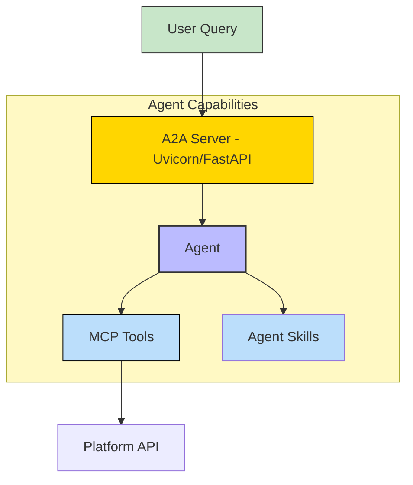
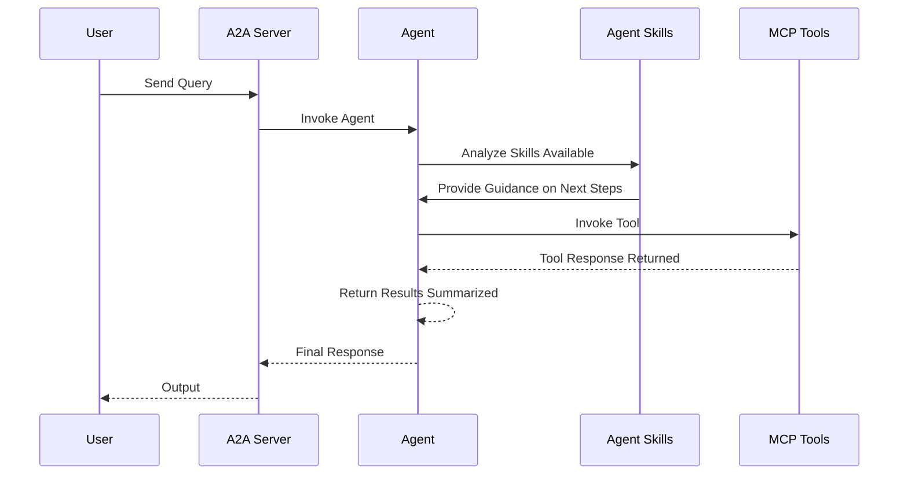

# Mealie - A2A | AG-UI | MCP


*Version: 0.2.9*

## Overview

Mealie MCP Server + A2A Server

It includes a Model Context Protocol (MCP) server and an out of the box Agent2Agent (A2A) agent

Manage your self-hosted Mealie instance through an MCP server!

This repository is actively maintained - Contributions are welcome!

### Supports:
- User & Household Management
- Recipe Management (CRUD, Import, Ratings)
- Meal Planning (Organizer)
- Shopping Lists
- System Administration
- Safe search levels (where applicable)
- Pagination control

## MCP

### MCP Tools

| Category | Description | Tag(s) |
|:---|:---|:---|
| `admin` | Manage administrative tasks | `admin` |
| `app` | Manage application settings and info | `app` |
| `explore` | Explore recipes and content | `explore` |
| `groups` | Manage recipe groups | `groups` |
| `households` | Manage households | `households` |
| `organizer` | Organize meals and plans | `organizer` |
| `recipe` | Manage individual recipes | `recipe` |
| `recipes` | Manage recipe collections | `recipes` |
| `shared` | Manage shared content | `shared` |
| `users` | Manage users | `users` |
| `utils` | Utility functions | `utils` |


### Using as an MCP Server

The MCP Server can be run in two modes: `stdio` (for local testing) or `http` (for networked access). To start the server, use the following commands:

#### Run in stdio mode (default):
```bash
mealie-mcp --transport "stdio"
```

#### Run in HTTP mode:
```bash
mealie-mcp --transport "http"  --host "0.0.0.0"  --port "8000"
```

AI Prompt:
```text
Find a recipe for lasagna
```

AI Response:
```text
Found 3 recipes for "lasagna":
1. Classic Meat Lasagna
2. Vegetable Lasagna
3. Spinach Lasagna Rolls
```

## A2A Agent

This package also includes an A2A agent server that can be used to interact with the Mealie MCP server.

### Architecture:



### Component Interaction Diagram



## Usage

### MCP CLI

| Short Flag | Long Flag                          | Description                                                                 |
|------------|------------------------------------|-----------------------------------------------------------------------------|
| -h         | --help                             | Display help information                                                    |
| -t         | --transport                        | Transport method: 'stdio', 'http', or 'sse' [legacy] (default: stdio)       |
| -s         | --host                             | Host address for HTTP transport (default: 0.0.0.0)                          |
| -p         | --port                             | Port number for HTTP transport (default: 8000)                              |
|            | --auth-type                        | Authentication type: 'none', 'static', 'jwt', 'oauth-proxy', 'oidc-proxy', 'remote-oauth' (default: none) |
|            | --token-jwks-uri                   | JWKS URI for JWT verification                                              |
|            | --token-issuer                     | Issuer for JWT verification                                                |
|            | --token-audience                   | Audience for JWT verification                                              |
|            | --oauth-upstream-auth-endpoint     | Upstream authorization endpoint for OAuth Proxy                             |
|            | --oauth-upstream-token-endpoint    | Upstream token endpoint for OAuth Proxy                                    |
|            | --oauth-upstream-client-id         | Upstream client ID for OAuth Proxy                                         |
|            | --oauth-upstream-client-secret     | Upstream client secret for OAuth Proxy                                     |
|            | --oauth-base-url                   | Base URL for OAuth Proxy                                                   |
|            | --oidc-config-url                  | OIDC configuration URL                                                     |
|            | --oidc-client-id                   | OIDC client ID                                                             |
|            | --oidc-client-secret               | OIDC client secret                                                         |
|            | --oidc-base-url                    | Base URL for OIDC Proxy                                                    |
|            | --remote-auth-servers              | Comma-separated list of authorization servers for Remote OAuth             |
|            | --remote-base-url                  | Base URL for Remote OAuth                                                  |
|            | --allowed-client-redirect-uris     | Comma-separated list of allowed client redirect URIs                       |
|            | --eunomia-type                     | Eunomia authorization type: 'none', 'embedded', 'remote' (default: none)   |
|            | --eunomia-policy-file              | Policy file for embedded Eunomia (default: mcp_policies.json)              |
|            | --eunomia-remote-url               | URL for remote Eunomia server                                              |


### A2A CLI
#### Endpoints
- **Web UI**: `http://localhost:8000/` (if enabled)
- **A2A**: `http://localhost:8000/a2a` (Discovery: `/a2a/.well-known/agent.json`)
- **AG-UI**: `http://localhost:8000/ag-ui` (POST)

| Short Flag | Long Flag         | Description                                                            |
|------------|-------------------|------------------------------------------------------------------------|
| -h         | --help            | Display help information                                               |
|            | --host            | Host to bind the server to (default: 0.0.0.0)                          |
|            | --port            | Port to bind the server to (default: 9000)                             |
|            | --reload          | Enable auto-reload                                                     |
|            | --provider        | LLM Provider: 'openai', 'anthropic', 'google', 'huggingface'           |
|            | --model-id        | LLM Model ID (default: qwen/qwen3-coder-next)                                  |
|            | --base-url        | LLM Base URL (for OpenAI compatible providers)                         |
|            | --api-key         | LLM API Key                                                            |
|            | --mcp-url         | MCP Server URL (default: http://localhost:8000/mcp)                    |
|            | --web             | Enable Pydantic AI Web UI                                              | False (Env: ENABLE_WEB_UI) |


### Using as an MCP Server
The MCP Server can be run in two modes: `stdio` (for local testing) or `http` (for networked access). To start the server, use the following commands:

#### Run in stdio mode (default):
```bash
mealie-mcp --transport "stdio"
```

#### Run in HTTP mode:
```bash
mealie-mcp --transport "http"  --host "0.0.0.0"  --port "8000"
```

AI Prompt:
```text
Find a recipe for lasagna
```

AI Response:
```text
Found 3 recipes for "lasagna":
1. Classic Meat Lasagna
2. Vegetable Lasagna
3. Spinach Lasagna Rolls
```

### Agentic AI
`mealie-mcp` is designed to be used by Agentic AI systems. It provides a set of tools that allow agents to interact with Mealie.

## Agent-to-Agent (A2A)

This package also includes an A2A agent server that can be used to interact with the Mealie MCP server.

### CLI

| Argument          | Description                                                    | Default                  |
|-------------------|----------------------------------------------------------------|--------------------------|
| `--host`          | Host to bind the server to                                     | `0.0.0.0`                |
| `--port`          | Port to bind the server to                                     | `9000`                   |
| `--reload`        | Enable auto-reload                                             | `False`                  |
| `--provider`      | LLM Provider (openai, anthropic, google, huggingface)          | `openai`                 |
| `--model-id`      | LLM Model ID                                                   | `qwen/qwen3-coder-next`     |
| `--base-url`      | LLM Base URL (for OpenAI compatible providers)                 | `http://ollama.arpa/v1`  |
| `--api-key`       | LLM API Key                                                    | `ollama`                 |
| `--mcp-url`       | MCP Server URL                                                 | `http://mealie-mcp:8000/mcp` |
| `--allowed-tools` | List of allowed MCP tools                                      | `web_search`             |

### Examples

#### Run A2A Server
```bash
mealie-agent --provider openai --model-id gpt-4 --api-key sk-... --mcp-url http://localhost:8000/mcp
```

#### Run with Docker
```bash
docker run -e CMD=mealie-agent -p 8000:8000 mealie-mcp
```

## Docker

### Build

```bash
docker build -t mealie-mcp .
```

### Run MCP Server

```bash
docker run -p 8000:8000 mealie-mcp
```

### Run A2A Server

```bash
docker run -e CMD=mealie-agent -p 8001:8001 mealie-mcp
```

### Deploy MCP Server as a Service

The Mealie MCP server can be deployed using Docker, with configurable authentication, middleware, and Eunomia authorization.

#### Using Docker Run

```bash
docker pull knucklessg1/mealie-mcp:latest

docker run -d \
  --name mealie-mcp \
  -p 8004:8004 \
  -e HOST=0.0.0.0 \
  -e PORT=8004 \
  -e TRANSPORT=http \
  -e AUTH_TYPE=none \
  -e EUNOMIA_TYPE=none \
  -e MEALIE_BASE_URL=https://mealie.example.com \
  -e MEALIE_TOKEN=your-token \
  -e MEALIE_VERIFY=true \
  knucklessg1/mealie-mcp:latest
```

For advanced authentication (e.g., JWT, OAuth Proxy, OIDC Proxy, Remote OAuth) or Eunomia, add the relevant environment variables:

```bash
docker run -d \
  --name mealie-mcp \
  -p 8004:8004 \
  -e HOST=0.0.0.0 \
  -e PORT=8004 \
  -e TRANSPORT=http \
  -e AUTH_TYPE=oidc-proxy \
  -e OIDC_CONFIG_URL=https://provider.com/.well-known/openid-configuration \
  -e OIDC_CLIENT_ID=your-client-id \
  -e OIDC_CLIENT_SECRET=your-client-secret \
  -e OIDC_BASE_URL=https://your-server.com \
  -e ALLOWED_CLIENT_REDIRECT_URIS=http://localhost:*,https://*.example.com/* \
  -e EUNOMIA_TYPE=embedded \
  -e EUNOMIA_POLICY_FILE=/app/mcp_policies.json \
  -e MEALIE_BASE_URL=https://mealie.example.com \
  -e MEALIE_TOKEN=your-token \
  -e MEALIE_VERIFY=true \
  knucklessg1/mealie-mcp:latest
```

#### Using Docker Compose

Create a `docker-compose.yml` file:

```yaml
services:
  mealie-mcp:
    image: knucklessg1/mealie-mcp:latest
    environment:
      - HOST=0.0.0.0
      - PORT=8004
      - TRANSPORT=http
      - AUTH_TYPE=none
      - EUNOMIA_TYPE=none
      - MEALIE_BASE_URL=https://mealie.example.com
      - MEALIE_TOKEN=your-token
      - MEALIE_VERIFY=true
    ports:
      - 8004:8004
```

For advanced setups with authentication and Eunomia:

```yaml
services:
  mealie-mcp:
    image: knucklessg1/mealie-mcp:latest
    environment:
      - HOST=0.0.0.0
      - PORT=8004
      - TRANSPORT=http
      - AUTH_TYPE=oidc-proxy
      - OIDC_CONFIG_URL=https://provider.com/.well-known/openid-configuration
      - OIDC_CLIENT_ID=your-client-id
      - OIDC_CLIENT_SECRET=your-client-secret
      - OIDC_BASE_URL=https://your-server.com
      - ALLOWED_CLIENT_REDIRECT_URIS=http://localhost:*,https://*.example.com/*
      - EUNOMIA_TYPE=embedded
      - EUNOMIA_POLICY_FILE=/app/mcp_policies.json
      - MEALIE_BASE_URL=https://mealie.example.com
      - MEALIE_TOKEN=your-token
      - MEALIE_VERIFY=true
    ports:
      - 8004:8004
    volumes:
      - ./mcp_policies.json:/app/mcp_policies.json
```

Run the service:

```bash
docker-compose up -d
```

#### Configure `mcp.json` for AI Integration

```json
{
  "mcpServers": {
    "mealie": {
      "command": "uv",
      "args": [
        "run",
        "--with",
        "mealie-mcp",
        "mealie-mcp"
      ],
      "env": {
        "MEALIE_BASE_URL": "https://mealie.example.com",
        "MEALIE_TOKEN": "your-token",
        "MEALIE_VERIFY": "true"
      },
      "timeout": 300000
    }
  }
}
```

## Install Python Package

```bash
python -m pip install mealie-mcp
```
```bash
uv pip install mealie-mcp
```

## Repository Owners


