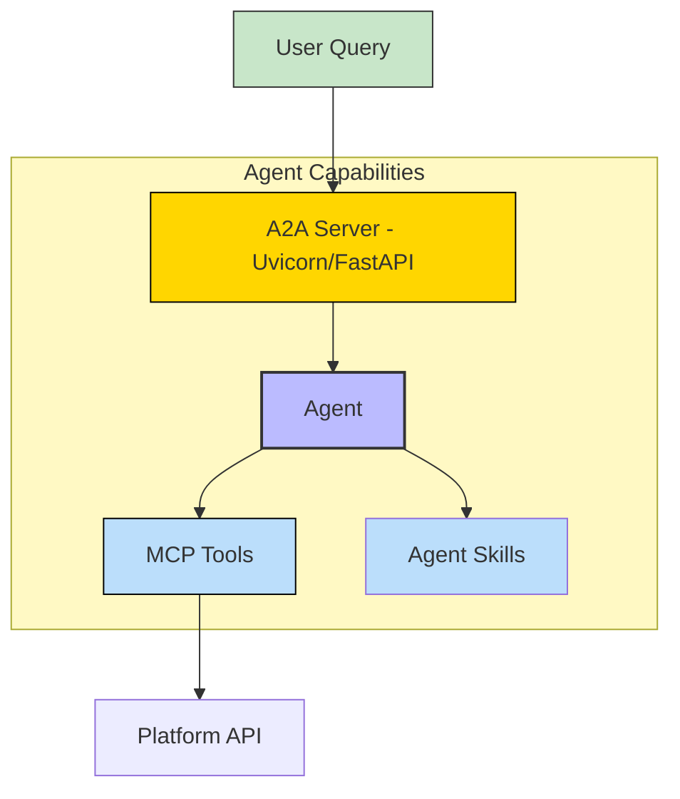
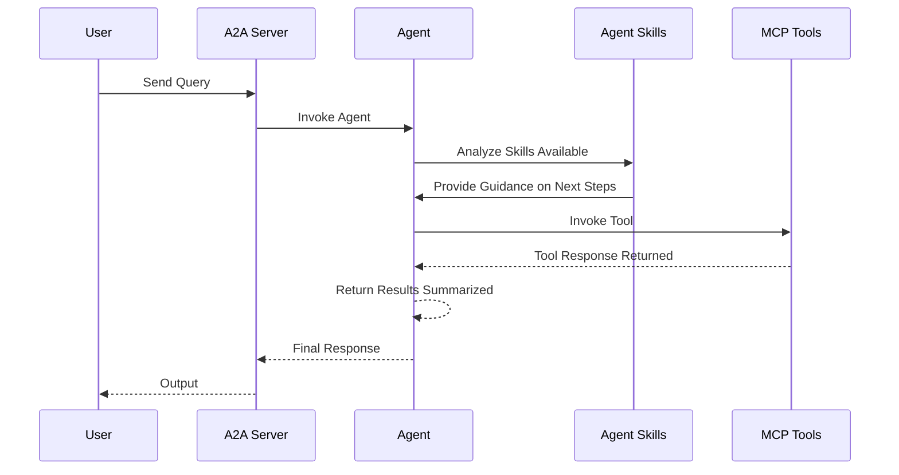
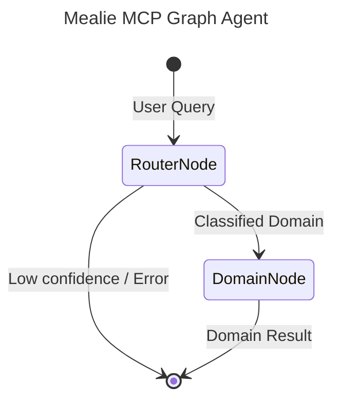

# Mealie - A2A | AG-UI | MCP


*Version: 0.11.0*

## Overview

Mealie MCP Server + A2A Server

It includes a Model Context Protocol (MCP) server and an out of the box Agent2Agent (A2A) agent

Manage your self-hosted Mealie instance through an MCP server!

This repository is actively maintained - Contributions are welcome!

### Supports:
- User & Household Management
- Recipe Management (CRUD, Import, Ratings)
- Meal Planning (Organizer)
- Shopping Lists
- System Administration
- Safe search levels (where applicable)
- Pagination control

## MCP

### Available MCP Tools

This server utilizes dynamic Action-Routed tools to optimize token overhead and maximize IDE compatibility.

| Tool Name | Description |
|-----------|-------------|
| `mealie_admin` | Consolidated Action-Routed tool for admin. Methods: get_app_info, get_app_statistics, check_app_config, get_admin_users, post_admin_users, unlock_users, get_admin_users_item_id, put_admin_users_item_id, delete_admin_users_item_id, generate_token, get_admin_households, post_admin_households, get_admin_households_item_id, put_admin_households_item_id, delete_admin_households_item_id, get_admin_groups, post_admin_groups, get_admin_groups_item_id, put_admin_groups_item_id, delete_admin_groups_item_id, check_email_config, send_test_email, get_admin_backups, post_admin_backups, get_admin_backups_file_name, delete_admin_backups_file_name, upload_one, import_one, get_maintenance_summary, get_storage_details, clean_images, clean_temp, clean_recipe_folders, debug_openai |
| `mealie_app` | Consolidated Action-Routed tool for app. Methods: get_startup_info, get_app_theme |
| `mealie_explore` | Consolidated Action-Routed tool for explore. Methods: get_explore_groups_group_slug_foods, get_explore_groups_group_slug_foods_item_id, get_explore_groups_group_slug_households, get_household, get_explore_groups_group_slug_organizers_categories, get_explore_groups_group_slug_organizers_categories_item_id, get_explore_groups_group_slug_organizers_tags, get_explore_groups_group_slug_organizers_tags_item_id, get_explore_groups_group_slug_organizerss, get_explore_groups_group_slug_organizerss_item_id, get_explore_groups_group_slug_cookbooks, get_explore_groups_group_slug_cookbooks_item_id, get_explore_groups_group_slug_recipes, get_explore_groups_group_slug_recipes_suggestions, get_recipe |
| `mealie_groups` | Consolidated Action-Routed tool for groups. Methods: get_all_households, get_one_household, get_logged_in_user_group, get_group_members, get_group_member, get_group_preferences, update_group_preferences, get_storage, start_data_migration, get_groups_reports, get_groups_reports_item_id, delete_groups_reports_item_id, get_groups_labels, post_groups_labels, get_groups_labels_item_id, put_groups_labels_item_id, delete_groups_labels_item_id, seed_foods, seed_labels, seed_units |
| `mealie_households` | Consolidated Action-Routed tool for households. Methods: get_households_cookbooks, post_households_cookbooks, put_households_cookbooks, get_households_cookbooks_item_id, put_households_cookbooks_item_id, delete_households_cookbooks_item_id, get_households_events_notifications, post_households_events_notifications, get_households_events_notifications_item_id, put_households_events_notifications_item_id, delete_households_events_notifications_item_id, test_notification, get_households_recipe_actions, post_households_recipe_actions, get_households_recipe_actions_item_id, put_households_recipe_actions_item_id, delete_households_recipe_actions_item_id, trigger_action, get_logged_in_user_household, get_household_recipe, get_household_members, get_household_preferences, update_household_preferences, set_member_permissions, get_statistics, get_invite_tokens, create_invite_token, email_invitation, get_households_shopping_lists, post_households_shopping_lists, get_households_shopping_lists_item_id, put_households_shopping_lists_item_id, delete_households_shopping_lists_item_id, update_label_settings, add_recipe_ingredients_to_list, add_single_recipe_ingredients_to_list, remove_recipe_ingredients_from_list, get_households_shopping_items, post_households_shopping_items, put_households_shopping_items, delete_households_shopping_items, post_households_shopping_items_create_bulk, get_households_shopping_items_item_id, put_households_shopping_items_item_id, delete_households_shopping_items_item_id, get_households_webhooks, post_households_webhooks, rerun_webhooks, get_households_webhooks_item_id, put_households_webhooks_item_id, delete_households_webhooks_item_id, test_one, get_households_mealplans_rules, post_households_mealplans_rules, get_households_mealplans_rules_item_id, put_households_mealplans_rules_item_id, delete_households_mealplans_rules_item_id, get_households_mealplans, post_households_mealplans, get_todays_meals, create_random_meal, get_households_mealplans_item_id, put_households_mealplans_item_id, delete_households_mealplans_item_id |
| `mealie_organizer` | Consolidated Action-Routed tool for organizer. Methods: get_organizers_categories, post_organizers_categories, get_all_empty, get_organizers_categories_item_id, put_organizers_categories_item_id, delete_organizers_categories_item_id, get_organizers_categories_slug_category_slug, get_organizers_tags, post_organizers_tags, get_empty_tags, get_organizers_tags_item_id, put_organizers_tags_item_id, delete_recipe_tag, get_organizers_tags_slug_tag_slug, get_organizerss, post_organizerss, get_organizerss_item_id, put_organizerss_item_id, delete_organizerss_item_id, get_organizerss_slug_slug |
| `mealie_recipes` | Consolidated Action-Routed tool for recipes. Methods: get_recipe_formats_and_templates, get_recipe_as_format, test_parse_recipe_url, create_recipe_from_html_or_json, parse_recipe_url, parse_recipe_url_bulk, create_recipe_from_zip, create_recipe_from_image, get_recipes, post_recipes, put_recipes, patch_many, get_recipes_suggestions, get_recipes_slug, put_recipes_slug, patch_one, delete_recipes_slug, duplicate_one, update_last_made, scrape_image_url, update_recipe_image, delete_recipe_image, upload_recipe_asset, get_recipe_comments, bulk_tag_recipes, bulk_settings_recipes, bulk_categorize_recipes, bulk_delete_recipes, bulk_export_recipes, get_exported_data, get_exported_data_token, purge_export_data, get_shared_recipe, get_shared_recipe_as_zip, get_recipes_timeline_events, post_recipes_timeline_events, get_recipes_timeline_events_item_id, put_recipes_timeline_events_item_id, delete_recipes_timeline_events_item_id, update_event_image, get_comments, post_comments, get_comments_item_id, put_comments_item_id, post_parser_ingredient, parse_ingredient, parse_ingredients, get_foods, post_foods, put_foods_merge, get_foods_item_id, put_foods_item_id, delete_foods_item_id, get_units, post_units, put_units_merge, get_units_item_id, put_units_item_id, delete_units_item_id, get_recipe_img, get_recipe_timeline_event_img, get_recipe_asset, get_user_image, get_validation_text |
| `mealie_shared` | Consolidated Action-Routed tool for shared. Methods: get_shared_recipes, post_shared_recipes, get_shared_recipes_item_id, delete_shared_recipes_item_id |
| `mealie_users` | Consolidated Action-Routed tool for users. Methods: get_token, oauth_login, oauth_callback, refresh_token, logout, register_new_user, get_logged_in_user, get_logged_in_user_ratings, get_logged_in_user_rating_for_recipe, get_logged_in_user_favorites, update_password, update_user, forgot_password, reset_password, update_user_image, create, delete, get_ratings, get_favorites, set_rating, add_favorite, remove_favorite |
| `mealie_utils` | Consolidated Action-Routed tool for utils. Methods: download_file |

## A2A Agent

This package also includes an A2A agent server that can be used to interact with the Mealie MCP server.

### Architecture:


```mermaid
---
config:
  layout: dagre
---
flowchart TB
 subgraph subGraph0["Agent Capabilities"]
        C["Agent"]
        B["A2A Server - Uvicorn/FastAPI"]
        D["MCP Tools"]
        F["Agent Skills"]
  end
    C --> D & F
    A["User Query"] --> B
    B --> C
    D --> E["Platform API"]

     C:::agent
     B:::server
     A:::server
    classDef server fill:#f9f,stroke:#333
    classDef agent fill:#bbf,stroke:#333,stroke-width:2px
    style B stroke:#000000,fill:#FFD600
    style D stroke:#000000,fill:#BBDEFB
    style F fill:#BBDEFB
    style A fill:#C8E6C9
    style subGraph0 fill:#FFF9C4
```

### Component Interaction Diagram


```mermaid
sequenceDiagram
    participant User
    participant Server as A2A Server
    participant Agent as Agent
    participant Skill as Agent Skills
    participant MCP as MCP Tools

    User->>Server: Send Query
    Server->>Agent: Invoke Agent
    Agent->>Skill: Analyze Skills Available
    Skill->>Agent: Provide Guidance on Next Steps
    Agent->>MCP: Invoke Tool
    MCP-->>Agent: Tool Response Returned
    Agent-->>Agent: Return Results Summarized
    Agent-->>Server: Final Response
    Server-->>User: Output
```


## Graph Architecture

This agent uses `pydantic-graph` orchestration for intelligent routing and optimal context management.


```mermaid
---
title: Mealie MCP Graph Agent
---
stateDiagram-v2
  [*] --> RouterNode: User Query
  RouterNode --> DomainNode: Classified Domain
  RouterNode --> [*]: Low confidence / Error
  DomainNode --> [*]: Domain Result
```

- **RouterNode**: A fast, lightweight LLM (e.g., `nvidia/nemotron-3-super`) that classifies the user's query into one of the specialized domains.
- **DomainNode**: The executor node. For the selected domain, it dynamically sets environment variables to temporarily enable ONLY the tools relevant to that domain, creating a highly focused sub-agent (e.g., `gpt-4o`) to complete the request. This preserves LLM context and prevents tool hallucination.

## Usage

### MCP CLI

| Short Flag | Long Flag                          | Description                                                                 |
|------------|------------------------------------|-----------------------------------------------------------------------------|
| -h         | --help                             | Display help information                                                    |
| -t         | --transport                        | Transport method: 'stdio', 'http', or 'sse' [legacy] (default: stdio)       |
| -s         | --host                             | Host address for HTTP transport (default: 0.0.0.0)                          |
| -p         | --port                             | Port number for HTTP transport (default: 8000)                              |
|            | --auth-type                        | Authentication type: 'none', 'static', 'jwt', 'oauth-proxy', 'oidc-proxy', 'remote-oauth' (default: none) |
|            | --token-jwks-uri                   | JWKS URI for JWT verification                                              |
|            | --token-issuer                     | Issuer for JWT verification                                                |
|            | --token-audience                   | Audience for JWT verification                                              |
|            | --oauth-upstream-auth-endpoint     | Upstream authorization endpoint for OAuth Proxy                             |
|            | --oauth-upstream-token-endpoint    | Upstream token endpoint for OAuth Proxy                                    |
|            | --oauth-upstream-client-id         | Upstream client ID for OAuth Proxy                                         |
|            | --oauth-upstream-client-secret     | Upstream client secret for OAuth Proxy                                     |
|            | --oauth-base-url                   | Base URL for OAuth Proxy                                                   |
|            | --oidc-config-url                  | OIDC configuration URL                                                     |
|            | --oidc-client-id                   | OIDC client ID                                                             |
|            | --oidc-client-secret               | OIDC client secret                                                         |
|            | --oidc-base-url                    | Base URL for OIDC Proxy                                                    |
|            | --remote-auth-servers              | Comma-separated list of authorization servers for Remote OAuth             |
|            | --remote-base-url                  | Base URL for Remote OAuth                                                  |
|            | --allowed-client-redirect-uris     | Comma-separated list of allowed client redirect URIs                       |
|            | --eunomia-type                     | Eunomia authorization type: 'none', 'embedded', 'remote' (default: none)   |
|            | --eunomia-policy-file              | Policy file for embedded Eunomia (default: mcp_policies.json)              |
|            | --eunomia-remote-url               | URL for remote Eunomia server                                              |


### A2A CLI
#### Endpoints
- **Web UI**: `http://localhost:8000/` (if enabled)
- **A2A**: `http://localhost:8000/a2a` (Discovery: `/a2a/.well-known/agent.json`)
- **AG-UI**: `http://localhost:8000/ag-ui` (POST)

| Short Flag | Long Flag         | Description                                                            |
|------------|-------------------|------------------------------------------------------------------------|
| -h         | --help            | Display help information                                               |
|            | --host            | Host to bind the server to (default: 0.0.0.0)                          |
|            | --port            | Port to bind the server to (default: 9000)                             |
|            | --reload          | Enable auto-reload                                                     |
|            | --provider        | LLM Provider: 'openai', 'anthropic', 'google', 'huggingface'           |
|            | --model-id        | LLM Model ID (default: nvidia/nemotron-3-super)                                  |
|            | --base-url        | LLM Base URL (for OpenAI compatible providers)                         |
|            | --api-key         | LLM API Key                                                            |
|            | --mcp-url         | MCP Server URL (default: http://localhost:8000/mcp)                    |
|            | --web             | Enable Pydantic AI Web UI                                              | False (Env: ENABLE_WEB_UI) |


### Using as an MCP Server
The MCP Server can be run in two modes: `stdio` (for local testing) or `http` (for networked access). To start the server, use the following commands:

#### Run in stdio mode (default):
```bash
mealie-mcp --transport "stdio"
```

#### Run in HTTP mode:
```bash
mealie-mcp --transport "http"  --host "0.0.0.0"  --port "8000"
```

AI Prompt:
```text
Find a recipe for lasagna
```

AI Response:
```text
Found 3 recipes for "lasagna":
1. Classic Meat Lasagna
2. Vegetable Lasagna
3. Spinach Lasagna Rolls
```

### Agentic AI
`mealie-mcp` is designed to be used by Agentic AI systems. It provides a set of tools that allow agents to interact with Mealie.

## Agent-to-Agent (A2A)

This package also includes an A2A agent server that can be used to interact with the Mealie MCP server.

### CLI

| Argument          | Description                                                    | Default                  |
|-------------------|----------------------------------------------------------------|--------------------------|
| `--host`          | Host to bind the server to                                     | `0.0.0.0`                |
| `--port`          | Port to bind the server to                                     | `9000`                   |
| `--reload`        | Enable auto-reload                                             | `False`                  |
| `--provider`      | LLM Provider (openai, anthropic, google, huggingface)          | `openai`                 |
| `--model-id`      | LLM Model ID                                                   | `nvidia/nemotron-3-super`     |
| `--base-url`      | LLM Base URL (for OpenAI compatible providers)                 | `http://ollama.arpa/v1`  |
| `--api-key`       | LLM API Key                                                    | `ollama`                 |
| `--mcp-url`       | MCP Server URL                                                 | `http://mealie-mcp:8000/mcp` |
| `--allowed-tools` | List of allowed MCP tools                                      | `web_search`             |

### Examples

#### Run A2A Server
```bash
mealie-agent --provider openai --model-id gpt-4 --api-key sk-... --mcp-url http://localhost:8000/mcp
```

#### Run with Docker
```bash
docker run -e CMD=mealie-agent -p 8000:8000 mealie-mcp
```

## Docker

### Build

```bash
docker build -t mealie-mcp .
```

### Run MCP Server

```bash
docker run -p 8000:8000 mealie-mcp
```

### Run A2A Server

```bash
docker run -e CMD=mealie-agent -p 8001:8001 mealie-mcp
```

### Deploy MCP Server as a Service

The Mealie MCP server can be deployed using Docker, with configurable authentication, middleware, and Eunomia authorization.

#### Using Docker Run

```bash
docker pull knucklessg1/mealie-mcp:latest

docker run -d \
  --name mealie-mcp \
  -p 8004:8004 \
  -e HOST=0.0.0.0 \
  -e PORT=8004 \
  -e TRANSPORT=http \
  -e AUTH_TYPE=none \
  -e EUNOMIA_TYPE=none \
  -e MEALIE_BASE_URL=https://mealie.example.com \
  -e MEALIE_TOKEN=your-token \
  -e MEALIE_SSL_VERIFY=true \
  knucklessg1/mealie-mcp:latest
```

For advanced authentication (e.g., JWT, OAuth Proxy, OIDC Proxy, Remote OAuth) or Eunomia, add the relevant environment variables:

```bash
docker run -d \
  --name mealie-mcp \
  -p 8004:8004 \
  -e HOST=0.0.0.0 \
  -e PORT=8004 \
  -e TRANSPORT=http \
  -e AUTH_TYPE=oidc-proxy \
  -e OIDC_CONFIG_URL=https://provider.com/.well-known/openid-configuration \
  -e OIDC_CLIENT_ID=your-client-id \
  -e OIDC_CLIENT_SECRET=your-client-secret \
  -e OIDC_BASE_URL=https://your-server.com \
  -e ALLOWED_CLIENT_REDIRECT_URIS=http://localhost:*,https://*.example.com/* \
  -e EUNOMIA_TYPE=embedded \
  -e EUNOMIA_POLICY_FILE=/app/mcp_policies.json \
  -e MEALIE_BASE_URL=https://mealie.example.com \
  -e MEALIE_TOKEN=your-token \
  -e MEALIE_SSL_VERIFY=true \
  knucklessg1/mealie-mcp:latest
```

#### Using Docker Compose

Create a `docker-compose.yml` file:

```yaml
services:
  mealie-mcp:
    image: knucklessg1/mealie-mcp:latest
    environment:
      - HOST=0.0.0.0
      - PORT=8004
      - TRANSPORT=http
      - AUTH_TYPE=none
      - EUNOMIA_TYPE=none
      - MEALIE_BASE_URL=https://mealie.example.com
      - MEALIE_TOKEN=your-token
      - MEALIE_SSL_VERIFY=true
    ports:
      - 8004:8004
```

For advanced setups with authentication and Eunomia:

```yaml
services:
  mealie-mcp:
    image: knucklessg1/mealie-mcp:latest
    environment:
      - HOST=0.0.0.0
      - PORT=8004
      - TRANSPORT=http
      - AUTH_TYPE=oidc-proxy
      - OIDC_CONFIG_URL=https://provider.com/.well-known/openid-configuration
      - OIDC_CLIENT_ID=your-client-id
      - OIDC_CLIENT_SECRET=your-client-secret
      - OIDC_BASE_URL=https://your-server.com
      - ALLOWED_CLIENT_REDIRECT_URIS=http://localhost:*,https://*.example.com/*
      - EUNOMIA_TYPE=embedded
      - EUNOMIA_POLICY_FILE=/app/mcp_policies.json
      - MEALIE_BASE_URL=https://mealie.example.com
      - MEALIE_TOKEN=your-token
      - MEALIE_SSL_VERIFY=true
    ports:
      - 8004:8004
    volumes:
      - ./mcp_policies.json:/app/mcp_policies.json
```

Run the service:

```bash
docker-compose up -d
```

#### Configure `mcp.json` for AI Integration

```json
{
  "mcpServers": {
    "mealie": {
      "command": "uv",
      "args": [
        "run",
        "--with",
        "mealie-mcp",
        "mealie-mcp"
      ],
      "env": {
        "MEALIE_BASE_URL": "https://mealie.example.com",
        "MEALIE_TOKEN": "your-token",
        "MEALIE_SSL_VERIFY": "true"
      },
      "timeout": 300000
    }
  }
}
```

## Install Python Package

```bash
python -m pip install mealie-mcp
```
```bash
uv pip install mealie-mcp
```

## Repository Owners


## MCP Configuration Examples

### 1. Standard IO (stdio) Deployment

```json
{
  "mcpServers": {
    "mealie-mcp": {
      "command": "uv",
      "args": [
        "run",
        "mealie-mcp"
      ],
      "env": {
        "ADMINTOOL": "True",
        "AGENT_DESCRIPTION": "<YOUR_AGENT_DESCRIPTION>",
        "AGENT_SYSTEM_PROMPT": "<YOUR_AGENT_SYSTEM_PROMPT>",
        "APPTOOL": "True",
        "DEFAULT_AGENT_NAME": "<YOUR_DEFAULT_AGENT_NAME>",
        "EXPLORETOOL": "True",
        "GROUPSTOOL": "True",
        "HOUSEHOLDSTOOL": "True",
        "MEALIE_BASE_URL": "<YOUR_MEALIE_BASE_URL>",
        "MEALIE_TOKEN": "<YOUR_MEALIE_TOKEN>",
        "MEALIE_VERIFY": "<YOUR_MEALIE_VERIFY>",
        "MISCTOOL": "True",
        "ORGANIZERTOOL": "True",
        "RECIPESTOOL": "True",
        "SHAREDTOOL": "True",
        "USERSTOOL": "True",
        "UTILSTOOL": "True"
      }
    }
  }
}
```

### 2. Streamable HTTP (SSE) Deployment

```json
{
  "mcpServers": {
    "mealie-mcp": {
      "command": "uv",
      "args": [
        "run",
        "mealie-mcp",
        "--transport",
        "http",
        "--host",
        "0.0.0.0",
        "--port",
        "8000"
      ],
      "env": {
        "ADMINTOOL": "True",
        "AGENT_DESCRIPTION": "<YOUR_AGENT_DESCRIPTION>",
        "AGENT_SYSTEM_PROMPT": "<YOUR_AGENT_SYSTEM_PROMPT>",
        "APPTOOL": "True",
        "DEFAULT_AGENT_NAME": "<YOUR_DEFAULT_AGENT_NAME>",
        "EXPLORETOOL": "True",
        "GROUPSTOOL": "True",
        "HOUSEHOLDSTOOL": "True",
        "MEALIE_BASE_URL": "<YOUR_MEALIE_BASE_URL>",
        "MEALIE_TOKEN": "<YOUR_MEALIE_TOKEN>",
        "MEALIE_VERIFY": "<YOUR_MEALIE_VERIFY>",
        "MISCTOOL": "True",
        "ORGANIZERTOOL": "True",
        "RECIPESTOOL": "True",
        "SHAREDTOOL": "True",
        "USERSTOOL": "True",
        "UTILSTOOL": "True"
      }
    }
  }
}
```
